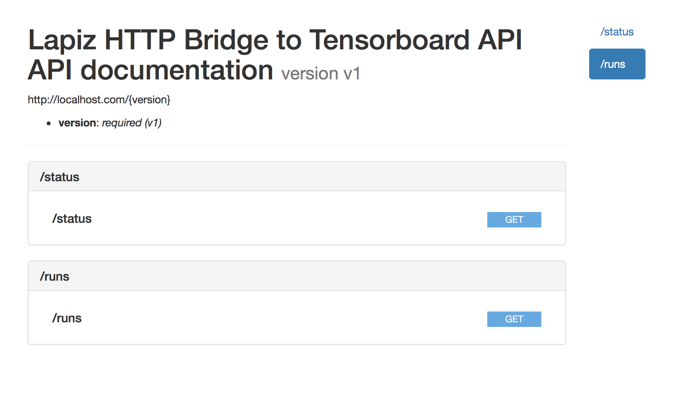

To create the [RAML](https://raml.org) html spec, install [raml2html](https://github.com/raml2html/raml2html) with

    npm install -g raml2html

and run

    raml2html api.raml > api.html

To see the html page on github, open <http://htmlpreview.github.io/?https://github.com/bosr/lapiz/blob/master/doc/api.html>

It should like this:

